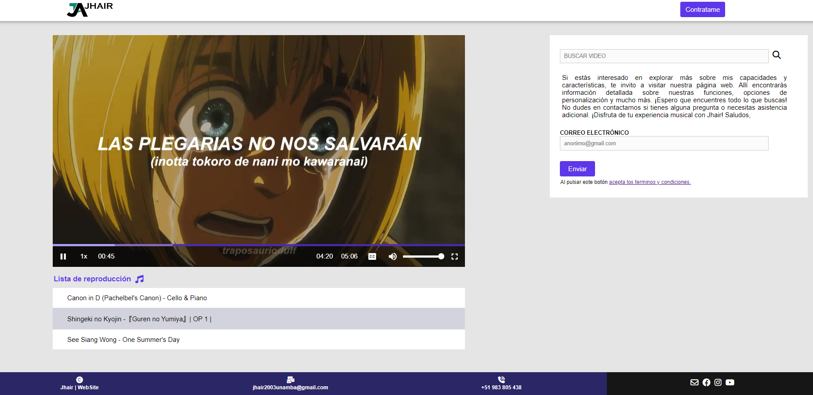

<div align="center">
    <a href="https://github.com/JheysonJhair/music_video_player.git">
      
    </a>
    <h1>Reproductor - Video</h1>
    <p align="center">
        Full Stack Developer Jhair
    </p>
</div>

## Preview




## Tecnologías

Este proyecto utiliza las siguientes tecnologías:

- Angular
- CSS

## Cómo levantar el proyecto

1. Clona el repositorio.

```bash
git clone https://github.com/JheysonJhair/music_video_player.git
```

```bash
cd music_video_player
```

2. Instala las dependencias con `npm install`.

```bash
npm install
```

3. Ejecuta el comando `ng serve` para iniciar el servidor de desarrollo.

```bash
ng serve
```

4. Abre tu navegador y visita `http://localhost:4200/`.

¡Listo! Ahora puedes comenzar a trabajar la aplicación sin problemas.
